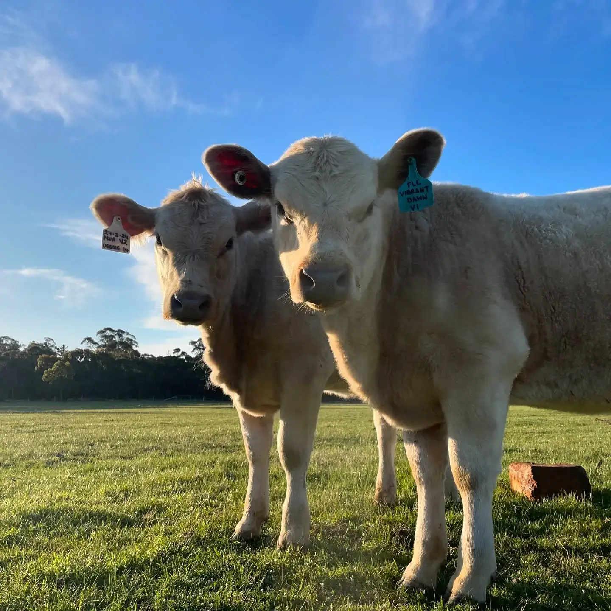

# Ferguson Livestock

The public website and stock-aware ordering experience for Ferguson Livestock, a family-run Murray Grey cattle farm in Snake Valley, Victoria.

[Visit the live site](https://www.fergusonlivestock.com.au) · [View the repository](https://github.com/DanielFerguson/ferguson-livestock)



## About the project

This project turns a small, periodic farm product release into a clear and dependable online buying experience. Customers can learn about the farm, compare beef boxes, add individual cuts, choose local delivery or farm pickup, and complete payment through Stripe.

I designed and built the site end to end, including the visual system, content structure, responsive storefront, checkout integration, and the stock-reservation workflow behind each order. The result combines the warmth and trust of a local farm brand with the safeguards expected from an ecommerce application.

## Highlights

- **Stock-aware ordering:** live availability is shared across beef boxes and individual cuts, including 10 kg bundles that consume two 5 kg stock units.
- **Safe checkout reservations:** an atomic Redis operation reserves every cart item together, preventing partial reservations and overselling during limited drops.
- **Resilient stock recovery:** cancelled and expired Stripe sessions release reserved stock, while idempotent webhook handling prevents double releases.
- **Flexible fulfilment:** customers can select paid delivery across the Ballarat region or free farm pickup, with the correct options passed into Stripe Checkout.
- **Drop-based sales:** releases can be activated immediately or scheduled in advance without redeploying the site.
- **Lead capture:** Klaviyo integration supports a waitlist between product drops.
- **Search-ready publishing:** canonical URLs, sitemap generation, structured data, social metadata, and intentionally excluded confirmation routes are built in.
- **Accessible, responsive UI:** semantic page structure, descriptive image text, mobile navigation, and clear sold-out and extras-only states support the full purchase journey.

## How it works

```text
Customer builds an order
        │
        ▼
Astro validates the cart server-side
        │
        ▼
Upstash Redis atomically reserves stock
        │
        ▼
Stripe Checkout processes payment
        │
        ├── completed → reservation removed; stock remains sold
        ├── expired   → reservation claimed; stock restored
        └── refunded  → stock restored once, idempotently
```

Stock reservations expire slightly after the Stripe Checkout session. This gives the webhook time to reconcile the order while ensuring abandoned carts do not hold limited inventory indefinitely.

## Technology

| Area | Tools |
| --- | --- |
| Front end | Astro 5, TypeScript, Tailwind CSS 4 |
| Payments | Stripe Checkout and signed webhooks |
| Inventory | Upstash Redis and atomic Lua scripts |
| Email marketing | Klaviyo |
| Images and metadata | Astro Assets, Sharp, Satori, Resvg |
| Hosting | Vercel |
| Package manager | Bun |

## Local development

### Prerequisites

- [Bun](https://bun.sh)
- Stripe, Upstash Redis, and Klaviyo credentials for testing the complete ordering flow

### Setup

```sh
git clone https://github.com/DanielFerguson/ferguson-livestock.git
cd ferguson-livestock
bun install
cp .env.example .env
bun dev
```

The development server is available at `http://localhost:4321`.

The content pages can be developed without live third-party credentials. Checkout, inventory, stock seeding, and waitlist requests require their corresponding environment variables from `.env.example`.

## Environment variables

| Variable | Purpose |
| --- | --- |
| `STRIPE_SECRET_KEY` | Creates Checkout sessions and retrieves order details |
| `STRIPE_WEBHOOK_SECRET` | Verifies incoming Stripe webhook signatures |
| `UPSTASH_REDIS_REST_URL` | Connects to the inventory store |
| `UPSTASH_REDIS_REST_TOKEN` | Authenticates Redis requests |
| `KLAVIYO_PUBLIC_API_KEY` | Identifies the Klaviyo account for subscriptions |
| `KLAVIYO_API_KEY` | Updates subscriber profile details |
| `KLAVIYO_LIST_ID` | Selects the waitlist destination |
| `STOCK_SEED_SECRET` | Protects the stock-initialisation endpoint |

Use test credentials for local development and never commit a populated `.env` file.

## Commands

| Command | Purpose |
| --- | --- |
| `bun dev` | Start the local development server |
| `bun run build` | Create the production build in `dist/` |
| `bun run check` | Build and run the repository's publishing checks |
| `bun run preview` | Preview the production build locally |
| `bun run generate:og` | Regenerate the social sharing image |

The custom check verifies important release constraints across the generated site, including canonical metadata, one primary heading per page, image alt attributes, valid JSON-LD, sitemap exclusions, and the absence of retired or unverified claims.

## Project structure

```text
src/
├── components/       Reusable storefront and brand sections
├── config/           Typed business, content, and product data
├── lib/              Stripe, Redis, and SEO helpers
├── pages/            Public routes and server API endpoints
└── styles/           Global design system and responsive styles
scripts/              OG image generation and release checks
docs/                 Product decisions, implementation plans, and source facts
public/               Icons, social artwork, and crawler configuration
```

Commercial facts and sensitive marketing claims are deliberately centralised in [`docs/content/business-facts.md`](docs/content/business-facts.md), while prices, inventory, delivery fees, and product contents live in typed configuration. This reduces the chance of stale claims being repeated across pages, metadata, and structured data.

## Design direction

The visual identity is intentionally **premium without pretence**: editorial typography and rich farm photography create a confident presentation, while plain language, visible pricing, freezer guidance, and an explicit delivery process keep the experience practical. The site is designed to feel like buying directly from a real local family—not from an anonymous national retailer.

## Author

Designed and developed by [Daniel Ferguson](https://github.com/DanielFerguson) for Ferguson Livestock.
