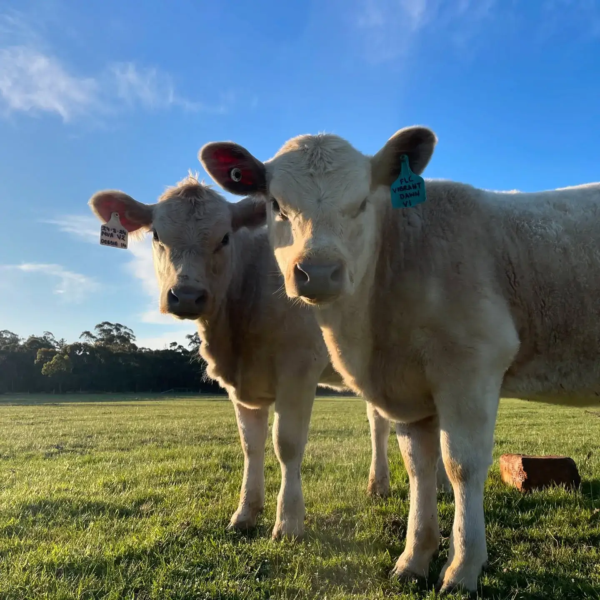

# Ferguson Livestock

The public website and stock-aware ordering experience for Ferguson Livestock, a family-run Murray Grey cattle farm in Snake Valley, Victoria.

[Visit the live site](https://www.fergusonlivestock.com.au) · [View the repository](https://github.com/DanielFerguson/ferguson-livestock)



> **Migration in progress:** this branch rebuilds the site in Laravel. The live site on `main` is still the Astro version until the switch-over. Checkout, drops and the admin arrive in later phases, so some highlights below describe the finished rebuild.

## About the project

This project turns a small, periodic farm product release into a clear and dependable online buying experience. Customers can learn about the farm, compare beef boxes, add individual cuts, choose local delivery or farm pickup, and complete payment through Stripe.

I designed and built the site end to end, including the visual system, content structure, responsive storefront, checkout integration, and the stock-reservation workflow behind each order. The result combines the warmth and trust of a local farm brand with the safeguards expected from an ecommerce application.

## Highlights

- **Stock-aware ordering:** live availability is shared across beef boxes and individual cuts, including 10 kg bundles that consume two 5 kg stock units.
- **Safe checkout reservations:** a single database transaction reserves every cart item together, preventing partial reservations and overselling during limited drops.
- **Resilient stock recovery:** cancelled and expired Stripe sessions release reserved stock, while idempotent webhook handling prevents double releases.
- **Flexible fulfilment:** customers can select paid delivery across the Ballarat region or free farm pickup, with the correct options passed into Stripe Checkout.
- **Drop-based sales:** releases can be activated immediately or scheduled in advance without redeploying the site.
- **Lead capture:** Klaviyo integration supports a waitlist between product drops.
- **Search-ready publishing:** canonical URLs, sitemap generation, structured data, social metadata, and intentionally excluded confirmation routes are built in.
- **Accessible, responsive UI:** semantic page structure, descriptive image text, mobile navigation, and clear sold-out and extras-only states support the full purchase journey.

## How it works

```text
Customer builds an order on the live order page
        │
        ▼
Laravel checks the drop is open and validates the order
        │
        ▼
One Postgres transaction reserves every item (or none)
        │
        ▼
Stripe Checkout processes payment
        │
        ├── paid            → order confirmed; confirmation emails sent
        ├── payment pending → stock stays held until the bank payment settles
        ├── expired/failed  → reservation released, exactly once
        └── refunded        → refund recorded; stock is adjusted by hand
```

Stripe webhooks are stored and de-duplicated by event ID, and a scheduled sweep reconciles any checkout whose webhook is late or missing, so abandoned carts never hold limited stock indefinitely.

## Technology

| Area | Tools |
| --- | --- |
| Framework | Laravel 13 on PHP 8.5 |
| Front end | Blade, Tailwind CSS 4 and Vite, with self-hosted fonts |
| Database, cache and queue | Postgres, Redis (Laravel Valkey in production) and Laravel Cloud's managed queue |
| Payments | Stripe Checkout and signed webhooks |
| Email marketing | Klaviyo |
| Tests and static analysis | Pest 5 (including browser tests with Playwright), Larastan and Pint |
| Social image | Satori, Resvg and Sharp |
| Hosting | Laravel Cloud (Sydney) |

## Local development

### Prerequisites

- PHP 8.4 or newer with the `pdo_pgsql`, `redis`, `intl` and `sockets` extensions, and Composer
- Node 24 and npm
- Postgres and Redis ([Laravel Herd](https://herd.laravel.com) provides both)

### Setup

```sh
git clone https://github.com/DanielFerguson/ferguson-livestock.git
cd ferguson-livestock
composer install
npm install
cp .env.example .env
php artisan key:generate
createdb ferguson_livestock && createdb ferguson_livestock_testing
php artisan migrate
composer run dev
```

`composer run dev` starts the app, queue worker, log tail and Vite together. The site is available at `http://localhost:8000`.

`.env.example` is set up for Herd's Postgres (user `root`, no password) and Redis. Stripe, Klaviyo and Resend credentials are added in later phases; use test-mode keys locally and never commit a populated `.env` file.

## Commands

| Command | Purpose |
| --- | --- |
| `composer run dev` | Start the app, queue worker, logs and Vite |
| `npm run build` | Build the production CSS, JavaScript, fonts and images |
| `vendor/bin/pest --testsuite=Unit,Feature` | Run the unit and feature tests (add `--parallel` for speed) |
| `vendor/bin/pest --testsuite=Browser` | Run the browser tests; needs `npm run build` and `npx playwright install chromium` first |
| `vendor/bin/phpstan analyse` | Static analysis with Larastan |
| `vendor/bin/pint` | Format PHP code |
| `npm run og-image` | Regenerate `public/og-image.jpg` (pass `-- <path>` to preview elsewhere) |

CI runs linting, static analysis, the unit and feature tests against Postgres 18, and the browser tests on every pull request.

## Project structure

```text
app/                  Application code (HTTP middleware, models, providers)
config/shop.php       Business facts and brand copy used across pages and metadata
resources/views/      Blade layouts, components and pages
resources/css/        Tailwind entry point and design tokens
resources/fonts/      Self-hosted fonts (SIL Open Font License)
resources/images/     Source photography and logo
routes/               Web routes
tests/                Pest unit, feature, browser and architecture tests
scripts/              Social image generation
docs/                 Product decisions, implementation plans and source facts
public/               Icons, social artwork and crawler configuration
```

Commercial facts and sensitive marketing claims are deliberately centralised in [`docs/content/business-facts.md`](docs/content/business-facts.md), while prices, stock, delivery fees and product contents will be managed per drop in the admin. This reduces the chance of stale claims being repeated across pages, metadata, and structured data.

## Design direction

The visual identity is intentionally **premium without pretence**: editorial typography and rich farm photography create a confident presentation, while plain language, visible pricing, freezer guidance, and an explicit delivery process keep the experience practical. The site is designed to feel like buying directly from a real local family—not from an anonymous national retailer.

## Author

Designed and developed by [Daniel Ferguson](https://github.com/DanielFerguson) for Ferguson Livestock.
